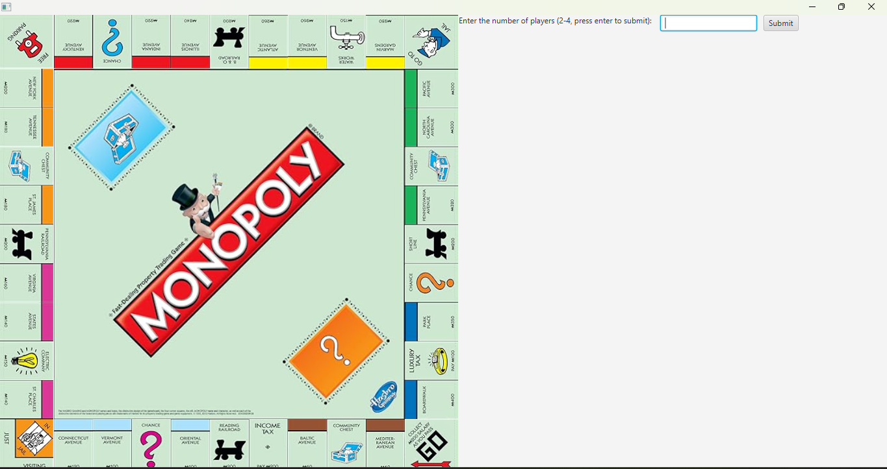
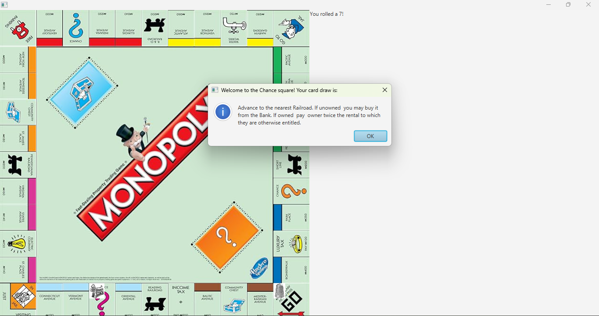
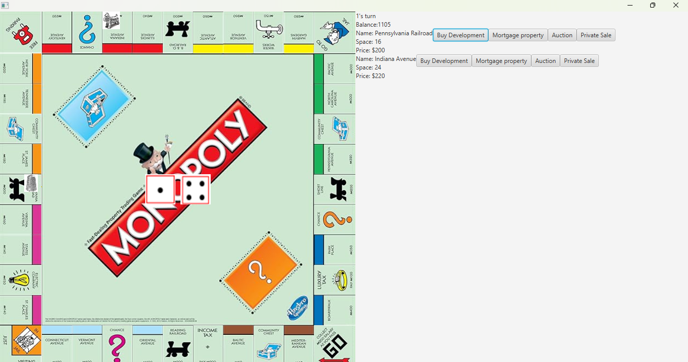
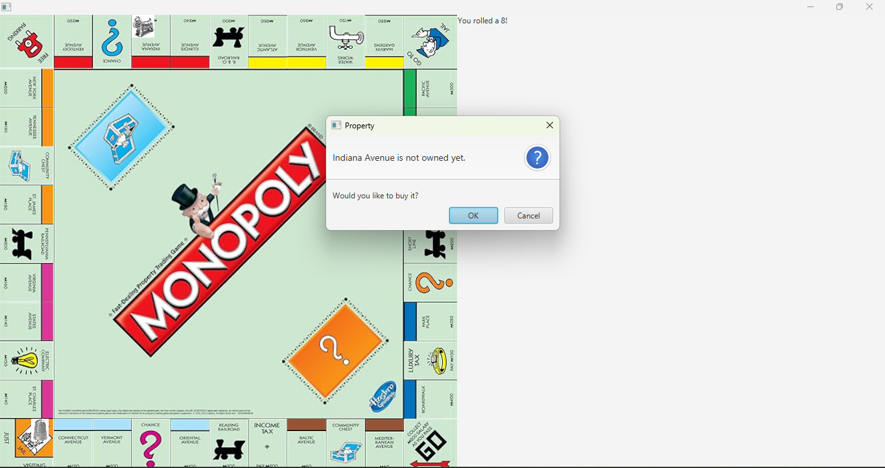
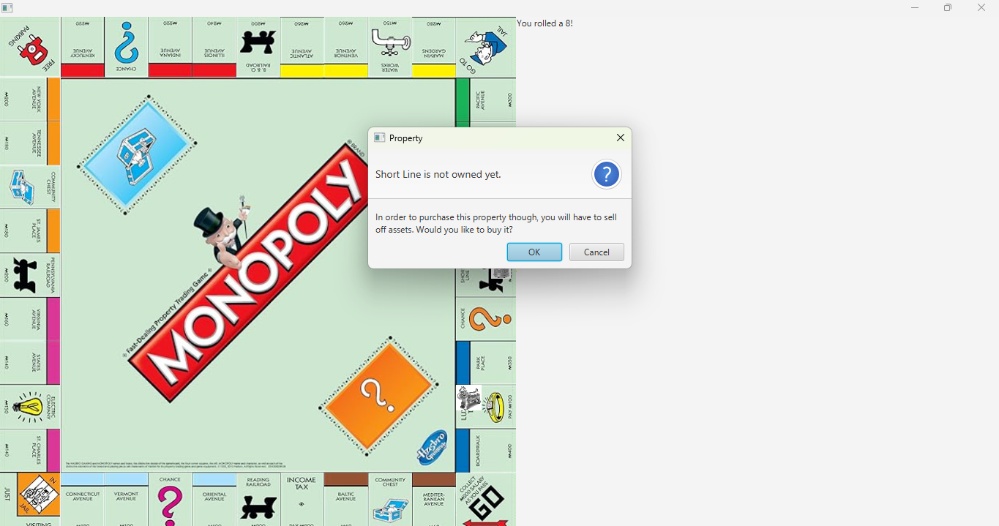

# Monopoly-JAVAFX
Monopoly applicaiton launched by javafx
A continuation of the games series 

---

## Table of Contents
- [Description](#description) 
- [Features](#features) 
- [Installation](#installation) 
- [Requirements](#requirements)
- [Dev Notes](#devnotes)
- [bug Log](#buglog)
- [Execution Flow](#ExecutionFlow)

---

## Description
Monopoly game implemented with JavaFX
Played with several local users in a pass-and-play style flow
Full implementation of official Hasbro rules (auctioning, mortaging, etc.)

Initially partially developed and tabled for a year, coming back to this with a more matured skillset has been an interesting experience.
Sifting through the issues left at the last attempt and completing implementations of unfinished components emphasizes made me greatful for the good documentation practices.

Game board built with each tile being individually mapped onto a gridpans, pieces moved by having their position updated to the different tile instances.

Dice are mapped to the center of the center pane, updated to display different combinations based on the last roll made. 

Dice, tiles, and game pieces are iteratevly loaded.

---

## Features
- Custom player and piece selection
- Intuitive, and user friendly UI/UX
- Event driven 

---

## Installation
Instructions on how to install and run the project

```bash 
git clone https://github.com/daleUrquhart/Monopoly
cd Monopoly/main
mvn clean install 
mvn javafx:run
```

---

## Requirements
Maven
JavaFX 

---

## Screenshots

| Feature | Screenshot |
|---------|------------|
| Start Page |  |
| Chance Draw |  |
| Mid Game |  |
| Buy Property |  |
| Buy Property With Insufficent Funds |  |

---

## BugLog and implmentation notes
### (TODO) Once a more final UI pattern is decided, update README screenshots
  - Video / GIF displays for specific logic flows?
  - Cover a breadth of scenarios, but dont clutter the readme
  - Also move these notes and organzie better in a BUGLOG.md
 
### (TODO) Address tech debt
  - Read over classes, ensure good class method javadocs

### (TODO) Bankruptcy is not tested
  - TODO, go through bankruptcy scenarios

### (TODO) Payment refinement
  - See notes in PaymentEvent.java
  
### (Done) Implement property scrolling view once 10 are owned plus bug fixes
  - Seperated logic in special property chance rents a little
  - Go to jail paying out go
    - Solved by moving around how go is payed out
  - Illegal rolls were getting through on unowned property and special squares.. 
    - Solved by adding a EnableRollEvent that jsut enables rolling again for special squares
  - Added a extra value to cards and removed isCredit()
  - Fixed with updates confined to MessagePane
  - Also addressed minor visual bugs
  - Display gets clutttered and breaks once several properties are squished into current plaeyr display
  
### (Done) Transition to event handlers for rest of project 
  - Right now, unowned properties go straight to auction if player has insufficent cash but sifficent net worth. It should ask if you want to buy and if insufficent cash do showAck sell assets and submit prompt and go back to buy or send to auction after submmit is clicked. This should be addressed during the implementation of UnownedPropertyEvent.
  - Property, Game, GameController
  - Process all payments through PaymentEvent
  - Process all messages through MessageEvent?

### (Done) Implemented event handling and made singletons for special squares, segregated event and boardspace classes to their own packages
  - Implementation of events on special squares went well, will be implementing them for the rest of the project
  - Created and implemented event classes for handling special square actions 
  - Referenced logic in Banker for singleton implementation

### (Done) Several fixes (see notes)
- Note:
  - The refactoring turned out to be alot larger than expected. Big changes in here, likely introduced bugs, though no new ones noted after initial testing

- (Done) handleMaxJailTurns() does not get next player
  - startJailTurn called handleMaxJailTurns and returns afterwards, without calling processNextTurn. Enabled rolls in hMJT and called pNT after teh hMJT call in sJT
- (Done) Several Chance / CC card issues
  - Player did not advance on cards that moved the player
    - Fixed with new game.movePlayerTo method (also handles roll effects now)
  - Cards that placed a credit onto the player did not do so
    - This case was not accounted for at all, added logic to Card and CardManager to account for it
  - For each player payments just debited the current player and didnt send anything to the other players
    - Added a for loop to pay every player that isnt current
  
- (Done) Implementation of turn abstraction lead to rising concerns regarding encapsulation. 
  - methods and logic was traded between classes to be delegated more appropriatley
  - Some method were transplanted entirely, some had components delegated elsewhere (Ex: Game should not manipulate state, only contain state data)
  - Removed forgotten redundancies (Ex: Looped and added players to Go in Game.buildMap, but players are no longer created befor this so it was really looping through the 0 players and doing nothing)

- (Done) Jail logic is good, but prompts jail turn handling for the enxt player if theyre in jail while the previous is managing their assets after a roll.
  - Issue stems from how handleJailTurn is called in hadnleRoll, added an extra layer to turn handling with a processNextTurn method in Game
  - Process next turn calls either handleTurn or handleJailTurn, each showing dice or jail bars respectively
  - Once Image is clicked, either handleRoll or startJailTurn begins
  - This solution is more inline with event-driven programming style

- (Done) When bankrupter is Banker, auction off all properties
  - Implemented a Banker condition in Player.bankrupted for this

- (Done) Streanline transactions between player 
  - Created transaction method instead of calling debit & credit at every spot of purchase

- (Done) Liquidation logic is bad, needs overhaul
  - Implemented a showAck event handler to recurse method on a button click to see if required balance is now present

- (Done) Auctioning and private sale needs tweaks. Auctioning adds property twice
  - Double propreties was a Entity.buy() issue.. fixed..

- (Done) Fix logic in handleSpecialSquare, especially bankruptcy checks
  - Fixed with showAck handler, and more thourough logic

- (Done) Roll always works, but works when its not supposed to on jail tunrs
  - Issue due to how handleRoll() handles jail turns. Fixed with processNextTurn(above)

- (Done) Fix bankruptcy and implement win handling (- balances currently possible)
  - Fixed by implementing a handleWinner and deleting dice

### (Fixed) Bad implementation of jail, dice not always re-enabled
- Complete overhaul of jail logic, similair to boolInput implementation, looks nice but doesnt enforce no rolling when not supposed to 
- After updating roll enabling logic dice no longer lock when not supposed to. Minor bug with jail (above)
- Dice work after landing on unowned proeprty adn a chance card that elts you buy a property, but that it
  - The chance card to a utility runs handleUnownedProperty, the only square method that lets a roll after so that checks out 
  - however, unowned, and other special squares do not work 
- Made adjustments to private sale
- Duct-taped a solution to phasing out reminaing GameView methods moved to message pane, could probably be made better by giving a message pane isntance to Player and Game with how much its used in there, but that raises coupling concerns
- Game crashes and behaves poorly on jail actions

### (Fixed) Illegal dice rolls allowed, poor display of properties after purchasing a new one
- Fix worked as expected
- Will also make the small fix of displaying a newly purchased property after submission of purchase before new roll by reloading player display after purchase
- Proposed solution works, dice only roll when expected now
- It is possible for dice rolls to be done during a turn action, look at fixing by disabling dice until it is ready


### (Fixed) Making message flow display more intuitive
Auction and property purchase done, required additions to Message pane and abstracting Auction logic. Alot of changes here will make this a sub-commit to solving this problem

Ok acks for CC and chance, etc. 
Yes and no buttons for landing on a property purchase prompt
We are clearing the pane in playerbuilding which is probably removing message and player displays from the thang

### (Fixed) Delegate message display logic into ists own API to clean up GameView
Addresssed, implemented new API, fixed property option logic aswell

Not giving an opportunity to manage assets after a player rolls. I want after a player rolls they get a chnce to manage assets after buying a new property and then the next player can manage theuir assets once the dice are rolled again

Maintaining the message pane properly has proven difficult, i feel like giving it its own class extending gridpane is the natural solution
Notes for implementation:
pane is the component that represents right side, it is a GridPane
GameView initialization adds pane to the right side of mainPane, will have to update pane creation to be the child of GridPane and give it a better name

(GameView) view.showMessage is hwo a message is currently displayed.
Maybe make right side message board its own object with a API for easily performning various recyclable displays liek purhcase aucction event etc.
Example:
MessageBoard view extends GridPane
view.clear()
view.addMessage(String message)
view.initiateAuction()
view.purchaseProperty(Property p)
etc.

Currently modified with GameView.showMessage
    /**
     * Adds a message ontop of currentPlayerDisplay
     * @param message Message to be displayed
     */
    void showMessage(String message) {
        pane.getChildren().clear();
        currentPlayerDisplay.getChildren().add(0, new Label(message));
        pane.add(currentPlayerDisplay, 0, 0); 
        
    }

### (Fixed) Player pieces not loading to respective corners
Both pieces loading to top left of tile (Seems to be just for Go tile on player creation)
Pieces overlap in first player's spot, likely done in Player constructor
Traces to setInitialLocation from Player constructor
Fixed by updating Player.ID before setting initial location, was not causing issues on later tiles as the ID was updated after the initial palcement so it knew where to properly go afterwarrds

#### Game crashes after player 2 goes for their first turn 
Happaned again: 2 landed on ones spot, on 2's first turn
Exception in thread "JavaFX Application Thread" java.lang.IndexOutOfBoundsException: Index 2 out of bounds for length 1
        at java.base/jdk.internal.util.Preconditions.outOfBounds(Preconditions.java:100)
        at java.base/jdk.internal.util.Preconditions.outOfBoundsCheckIndex(Preconditions.java:106)
        at java.base/jdk.internal.util.Preconditions.checkIndex(Preconditions.java:302)
        at java.base/java.util.Objects.checkIndex(Objects.java:365)
        at java.base/java.util.ArrayList.get(ArrayList.java:428)
        at com.monopoly/com.monopoly.Game.getNextPlayer(Game.java:189)
        at com.monopoly/com.monopoly.Game.handleRoll(Game.java:473)
        at com.monopoly/com.monopoly.GameController.lambda$startGame$0(GameController.java:54)

They were on the same tile here, maybe that was the issue, can go several turn cycles most times
Looks like players were lost and attempted to index the empty player list
        at java.base/java.util.ArrayList.get(ArrayList.java:428)
        at com.monopoly/com.monopoly.Game.getNextPlayer(Game.java:185)
        at com.monopoly/com.monopoly.Game.handleRoll(Game.java:466)
        at com.monopoly/com.monopoly.GameController.lambda$0(GameController.java:52)

#### (Fixed) First player went twice for after first round
After second turn, player 2 went 
This was probably just doubles after further testing, closed.

---

## ExecutionFlow
### TODO